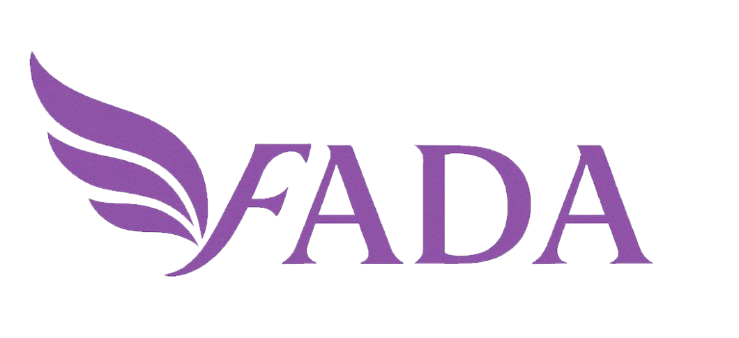

FADA - Ferramenta de Apoio, Defesa e Acolhimento

Ferramenta de apoio para mulheres em situação de violência de gênero
Descrição

O FADA é um aplicativo desenvolvido para ajudar mulheres a identificar sinais de violência de gênero em seus relacionamentos e oferecer informações sobre como buscar apoio especializado. Através de um simples questionário, o app monitora o humor e o contexto das usuárias, detectando padrões e sinais de risco. Quando identificado um possível risco, o FADA orienta sobre onde procurar ajuda, seja em delegacias, centros de reabilitação ou serviços de apoio psicológico.

O FADA também oferece um recurso que gera documentos que podem ser usados para abrir processos de apoio e ajuda especializada, além de ser inclusivo para mulheres cis, mulheres trans e pessoas não binárias.
Objetivos

    Identificar sinais de risco de violência de gênero.

    Oferecer informações claras sobre como buscar ajuda especializada.

    Proporcionar um ambiente seguro, acolhedor e com autonomia para usuárias.

    Integrar-se com sistemas governamentais para facilitar o acesso a serviços de saúde e apoio.

Funcionalidades
Para Usuárias

    Cadastro e Questionário Inicial
    Ao abrir o app, a usuária preenche um questionário simples que ajuda a entender seu contexto, seja com ou sem cadastro.

    Monitoramento de Humor e Dados
    Diariamente, a usuária registra como se sente. O app monitora esses dados para identificar padrões de risco.

    Questionário Detalhado
    Se um risco é identificado, o FADA sugere um questionário mais detalhado com perguntas baseadas em ferramentas de avaliação como o FRIDA, para compreender melhor a situação.

    Encaminhamento para Apoio Especializado
    Após o preenchimento, o app sugere locais e centros de atendimento especializados, como delegacias, clínicas de reabilitação ou apoio psicológico, e possibilita a geração de documentos que podem ser usados para abrir processos formais.

Para Profissionais de Saúde

    Exportação de Dados
    O app permite que os dados sejam exportados para profissionais de saúde para que possam oferecer apoio especializado.

Inclusividade

    Mulheres Cis, Mulheres Trans e Pessoas Não Binárias
    O app foi desenhado para ser inclusivo, com uma interface familiar e acessível, imitando aplicativos de monitoramento de ciclo menstrual e acompanhamento de humor.

Tecnologias e Inovação

O FADA foi desenvolvido utilizando a tecnologia React Native, garantindo:

    Segurança: Proteção de dados sensíveis.

    Escalabilidade: Capacidade de crescer conforme a demanda.

    Responsividade: Acesso multiplataforma para garantir que usuárias de diferentes dispositivos possam utilizá-lo.

Além disso, o FADA conta com tecnologias de análise preditiva e inteligência artificial, que ajudam a identificar padrões de risco a partir dos dados coletados.
Integração com Sistemas Governamentais

O FADA é modular e compatível com sistemas governamentais de saúde, facilitando a integração e a ampliação do seu impacto.
Como Funciona
Caminho da Usuária

    Cadastro ou Acesso Sem Cadastro
    A usuária responde a um questionário inicial sobre seu contexto.

    Monitoramento de Humor
    Diariamente, ela registra seu humor e acontecimentos do dia.

    Identificação de Sinais de Risco
    O app monitora os dados e, caso perceba padrões preocupantes, sugere um questionário detalhado.

    Encaminhamento para Apoio
    Com base nas respostas, o FADA sugere órgãos especializados próximos, e pode gerar um documento para facilitar o acesso ao apoio.

Impacto Esperado

O FADA visa oferecer suporte e autonomia para mulheres em situação de violência de gênero, reduzindo a subnotificação e acelerando o acesso a serviços de apoio. O app é uma ferramenta de empoderamento, que transforma dados em proteção e esperança, proporcionando um caminho seguro e informado para quem sofre violência.
Contribuindo

Se você deseja contribuir para o projeto ou tem sugestões para melhorar o FADA, por favor, entre em contato conosco ou envie um pull request!
Licença

Este projeto está licenciado sob a Licença MIT.

Esse README pode ser ajustado conforme o progresso do projeto e a necessidade de mais detalhes sobre a implementação. A ideia é dar uma visão geral do propósito, funcionalidades e impacto do FADA, além de tornar o processo de contribuição claro para outros desenvolvedores e colaboradores.
